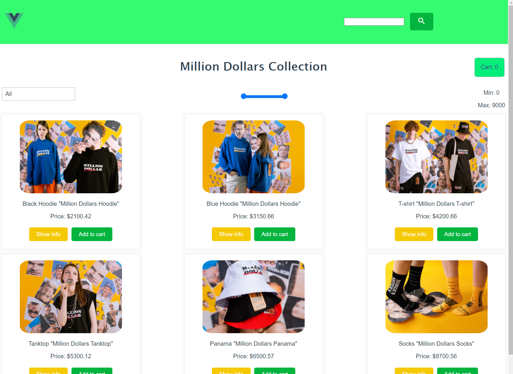
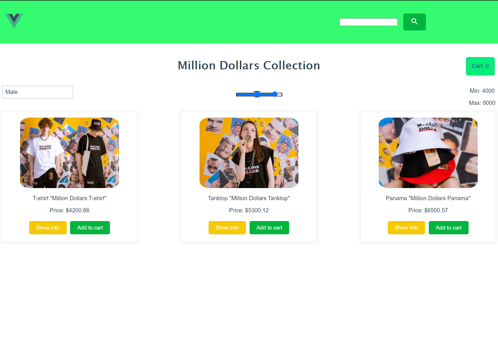
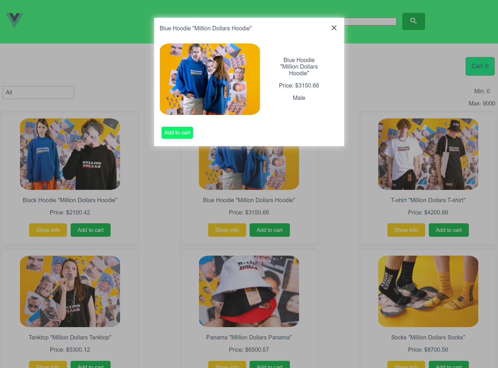
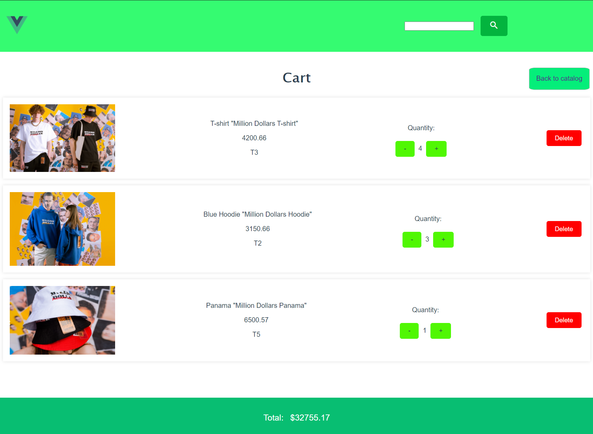
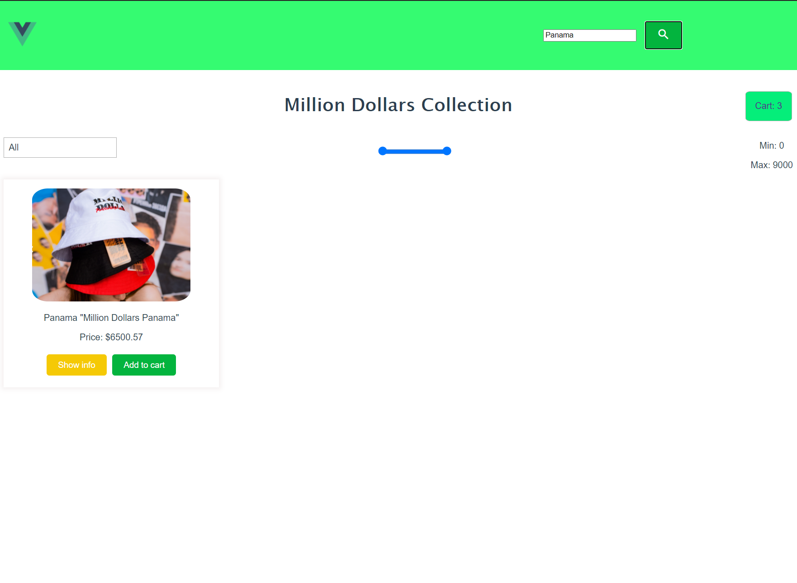

# Online clothes shop

## Project setup
```
npx json-server db.json
npm run serve
```

## Online shop tutorial for learning Vue.js
<br />

### Catalog page

<br />

### Filtered by price and gender

<br />

### Ability to view product information

<br />

### Adding an item to the cart, changing the quantity, calculating the final price and deleting from cart

<br />

### Search by name

<br />


